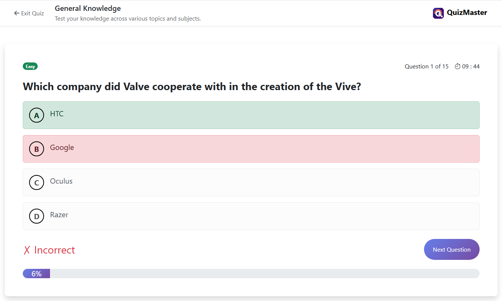

# 🎯 QuizMaster  

QuizMaster is a fun and interactive web-based quiz application built with **HTML, CSS, and JavaScript**.  
It allows users to test their knowledge with multiple-choice questions, get instant feedback, and see their final score with a clean and responsive UI.  


## 📸 Preview  
  
*(You can add a screenshot of your project here)*  


## ✨ Features  
- 📚 Multiple-choice questions with shuffled answers  
- 🎨 Clean and responsive UI with Bootstrap  
- 💡 Hover effects and smooth transitions  
- ✅ Correct / Wrong answer highlighting  
- 📊 Score tracking with percentage calculation  
- 🎉 Final results summary with retake, new quiz, and home navigation  
- 📱 Mobile-friendly layout  


## 🛠️ Tech Stack  
- **HTML5**  
- **CSS3** (Bootstrap for styling)  
- **JavaScript (ES6+)**  


## 📂 Project Structure  
```
quizMaster/
│── index.html          # Home page
│── getStart.html       # Quiz start page
│── quiz.html           # Main quiz page
│
├── css/
│   └── main.css        # Main stylesheet
│
├── js/
│   ├── getstart.js     # Start page logic
│   └── quiz.js         # Quiz functionality
│
└── assets/             # (Optional) images/icons
```


## 🚀 Getting Started  

1. **Clone the repo**  
   ```bash
   git clone https://github.com/your-username/quizMaster.git
   ```

2. **Open in browser**  
   Simply open `index.html` in your browser.  

3. **Enjoy the quiz!** 🎉  


## 🎮 How It Works  
1. Start the quiz from the **Get Started** page.  
2. Answer each question by selecting the correct option.  
3. After finishing, view your results:  
   - ✅ Correct answers  
   - ❌ Wrong answers  
   - 📊 Percentage score (with colored indicator)  
4. Retake the quiz or return to the home page.  


## 🖼️ Example Result Screen  
- 🟢 **80%+** → Success (green)  
- 🟡 **50% – 79%** → Warning (yellow)  
- 🔴 **Below 50%** → Danger (red)  


## 📌 Future Improvements  
- Leaderboard for multiple players  


## 🤝 Contributing  
Pull requests are welcome! If you’d like to suggest major changes, please open an issue first.  


## 📄 License  
This project is licensed under the MIT License – feel free to use and modify it.  


## 👨‍💻 Author  
Built with ❤️ by **Omar Wael**  
